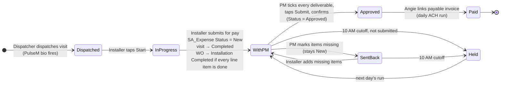

# Vista pay approval flow

Status: **design approved 2026-09-27; Salesforce automation drafted in `salesforce/`, not yet deployed.**
Built on existing objects and fields, plus one new picklist value (`Vista` on `SA_Expense__c.Type__c`, approved).

## Terms

| Term | Meaning | Who creates it | Salesforce |
|---|---|---|---|
| **Pay request** ("Submit for pay" / "Cobrar trabajo") | The installer asks to be paid for work they have **completed**. The normal path on every job. | Installer, in Vista | `SA_Expense__c`, `Type__c = Vista`, created at `Status__c = New`, `Did_you_complete_the_job_or_service__c = Yes` |
| **Draw** ("Draw" / "Adelanto") | A payment **before the job is complete**. The installer asks the PM directly, outside the app. | PM, in Vista | `SA_Expense__c`, `Type__c = Vista`, created at `Status__c = Approved`, `Did_you_complete_the_job_or_service__c = No` |

## The rule: the PM submits once, and it arrives approved

The PM's confirmed submit in Vista **is** the approval. Vista writes exactly what the active *Titan Approval Process* writes on final approval:

| Field | Value | Same as Titan's |
|---|---|---|
| `Status__c` | `Approved` | `Status_Approved` field update |
| `Approver__c` | the PM's User `FirstName & " " & LastName` | `Approver` field update: `$User.FirstName & " " & $User.LastName` (confirmed in `docs/describe/APPROVAL.md`) |

From there the record moves through Salesforce like any other approved SA Expense: payable invoice, Angie's daily ACH run. Vista records never enter an approval process and never sit in the *SA_expense_approval* queue.

Before every submit, Vista asks:

- Draws: **"Are you sure you want to submit this draw?"** / **"¿Seguro que quieres enviar este adelanto?"**
- Pay requests: **"Are you sure you want to submit this pay request?"** / **"¿Seguro que quieres enviar esta solicitud de pago?"**

The sheet repeats the amount, job and crew (and, for draws, who asked and what it covers). Cancel leaves everything as it was.

## Decisions (Matt, 2026-09-27)

| Topic | Decision |
|---|---|
| Approval | **The PM submits once in Vista**, after a confirmation question; the record is created or updated as `Approved`. No second approval in Salesforce. |
| Draw notices | **Mike Duncan is emailed about every draw** issued from Vista (flow *Vista - Draw Issued Notice*). |
| Cutoff | **10:00 AM**, daily run. |
| Draws | Payment before completion. Installer asks the PM directly; PM issues it. Which jobs: **PM judgment**, optionally narrowed by `web/content/draw-rules.json`. At least one progress photo. |
| Line items | Installer marks `Installation Completed`; measure tech marks `Measurement Completed`. |
| Measure techs | Vista users, **measurement visits only**. No pay in Vista. |
| WorkOrder | Moves to `Installation Completed` (review step) when the installer's pay request comes in and every line item is done. |
| `Vista` picklist value | Approved. |

## Pay request flow

## Who does what

| Step | Who | Where | Salesforce effect |
|---|---|---|---|
| 1. Dispatch | Dispatcher | Field Service | `ServiceAppointment.Status = Dispatched`. Existing PulseM automation sends the bio. **Vista shows nothing that isn't Dispatched.** |
| 2. Start | Installer / measure tech | Vista · Job | `ServiceAppointment.Status = In Progress`, `ActualStartTime` |
| 3. Line items | Installer / measure tech | Vista · Job | `WorkOrderLineItem.Status` → `Installation Completed` or `Measurement Completed` |
| 4. Submit for pay | Installer | Vista · Submit for Pay | Creates `SA_Expense__c` at `New`, job complete = Yes. Flow *Vista - Pay Request Submitted* completes the visit and, if every line item is done, moves the WO to review. |
| 5. Review + submit | PM | Vista · Approve | Deliverables checklist → **Submit** → "Are you sure…?" → `Status__c = Approved`, `Approver__c = PM`. **Send back** → stays `New`, missed items in the manifest. |
| 6. Pay | Angie | Salesforce, as today | Links `Payable_Invoice_New__c` in her daily run. |
| 7. Chase | Vista API | 10:00 AM daily | Texts every sub whose pay request is still `New`, in their language, listing what's missing. One reminder per PM with unreviewed requests. |

## Draws (payment before completion)

1. The installer asks the PM for a draw **directly**. Vista has no installer button for it.
2. The PM opens the job in Vista and fills in **Issue a draw**: amount (capped at contract minus labor already paid), what it covers, who asked.
3. The PM can issue it only when the job has at least one **progress photo**.
4. **"Are you sure you want to submit this draw?"** Confirm, and Vista creates the `SA_Expense__c` already `Approved`, with job complete = No and the PM in `Approver__c`.
5. Flow *Vista - Draw Issued Notice* emails **Mike Duncan**: amount, job, customer, installer, the PM who issued it, what it covers, and a link to the record.
6. Draws skip the PM queue and the 10 AM notices, and never complete the visit or move the WorkOrder.

The final pay request still comes from the installer at completion and covers what's left after the draws.

## PM review: the deliverables checklist (pay requests)

"Submit" stays disabled until every required line is ticked. Unticked lines, with the PM's reason, become the message to the installer.

| Line | Source | Required |
|---|---|---|
| One line per required photo kind, e.g. *Before, each elevation: 2 (need 4)* | trade checklist `photos[]` vs manifest photos | when `min > 0`; lines below the minimum can't be ticked |
| Installer checklist, e.g. *10 of 10 steps* | manifest `checklist.done` | yes |
| Work description matches the scope | `Description_of_Work_Performed__c` vs WO | yes |
| Job complete as claimed | `Did_you_complete_the_job_or_service__c` | yes |
| Line items marked installed, e.g. *4 of 4* | `WorkOrderLineItem.Status` | when the WO has line items |
| Amount within contract | `Amount__c` ≤ `Sales_Price__c − Total_SA_Expense_Labor__c` | yes |
| Additional work documented | manifest note + photo | only if claimed |

## Keeping Vista records out of Titan

The active *Titan Approval Process* admits any SA Expense with an Office and `Type__c ≠ Jotform`, which includes `Vista`. Vista never submits to it, but someone clicking **Submit for Approval** on a Vista pay request in Salesforce would route it to the queue and skip the PM checklist.

**Setup change (DevSandi first, then production):** Setup → Approval Processes → SA Expense → *Titan Approval Process* → Entry Criteria → add `Type` **not equal to** `Vista`. If Setup won't edit the active process, deactivate, edit, reactivate in the same sitting. The Jotform process already only admits `Jotform`.

What Vista gives up by not using Titan, and what replaces it:

| Titan provides | Vista equivalent |
|---|---|
| Approval history on the record | Manifest `approval` block (who, when, every checklist line) + `Approver__c` + field history on `Status__c` (switch it on if it's off) |
| Record lock after approval | Not replicated. Office users can still edit an approved Vista record, as with any unlocked record. Say if you want a validation rule to lock `Amount__c` once a Vista record is `Approved`. |

## Messages to subcontractors (10:00 AM)

Sent by the Vista API. One text per sub per day, in the installer's language, respecting `ServiceAppointment.SMS_Opt_out__c`. Draws never generate these.

> Vista: this pay request was not submitted for today's pay run. Job 00041880 (Pierce, 4478 Columbia Rd): Before, each elevation: 2 (need 4) — missing; House wrap and flashing: 0 (need 2) — missing. Add it in Vista and your PM will review it for the next run.

> Vista: esta solicitud de pago no fue enviada para el pago de hoy. Trabajo 00041880 (Pierce, 4478 Columbia Rd): Antes, cada fachada: 2 (mínimo 4) — falta; Membrana y sellado: 0 (mínimo 2) — falta. Agrégalo en Vista y tu PM la revisará para el próximo pago.

## Salesforce build (in `salesforce/`)

| Item | Type | Purpose |
|---|---|---|
| `Vista` value on `SA_Expense__c.Type__c` | picklist value | identifies app records |
| `Vista_Pay_Request_Submitted` | record-triggered flow, after create: `Type__c = Vista`, `Status__c = New`, job complete = Yes | completes the visit; moves the WO to review when every line item is done |
| `Vista_Draw_Issued_Notice` | record-triggered flow, after create: `Type__c = Vista`, job complete = No | emails Mike Duncan (active user looked up by name) about every draw |
| `Vista_Waiting_on_PM`, `Vista_Draws`, `Vista_Submitted_Not_Invoiced` | list views | PM queue, draws, approved but not yet on a payable invoice |
| Titan entry criteria | Setup change | add `Type ≠ Vista` (above) |

Deploy targets **DevSandi** only; `salesforce/deploy.sh` refuses any non-sandbox org. Both flows deploy as **Draft**.

## Guardrails

- **Confirmation.** Every PM submit and every draw goes through "Are you sure…?".
- **Test records.** `TEST_SA__c = true` records are excluded everywhere and skipped by both flows.
- **Audit.** Manifest + `Approver__c` + `Status__c` field history; Mike Duncan's email for every draw.

## Start simple, harden later (Matt, 2026-09-27)

Launch with the defaults and tighten once real usage shows how many edits happen.

| Topic | At launch | Harden if needed |
|---|---|---|
| Approved Vista records | Not locked; office users can edit them like any unlocked record | Validation rule locking `Amount__c` (and more) once `Status__c = Approved` and `Type__c = Vista` |
| Mike Duncan draw notices | Email only | Add a text from the Vista API |
| Draw eligibility | PM judgment on any active job | Fill in `web/content/draw-rules.json` (minimum contract, trades) |
| `Approver__c` format | PM's `FirstName LastName`, same as Titan | — |

**Worth watching in the first weeks:** `Status__c` field history on Vista records edited after approval, and the *Vista - Draws* list view.
