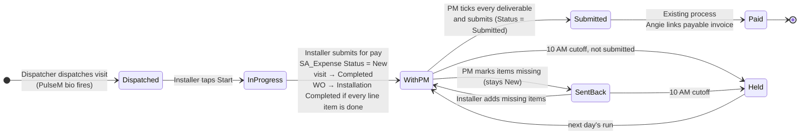

# Vista pay approval flow

Status: **design approved 2026-09-27; Salesforce automation drafted in `salesforce/`, not yet deployed.**
Built entirely in Field Service on existing objects and fields, plus one new picklist value (`Vista` on `SA_Expense__c.Type__c`, approved by Matt).

## Terms

| Term | Meaning | Who creates it | Salesforce |
|---|---|---|---|
| **Pay request** ("Submit for pay" / "Cobrar trabajo") | The installer asks to be paid for work they have **completed**. The normal path on every job. | Installer, in Vista | `SA_Expense__c`, `Type__c = Vista`, created at `Status__c = New`, `Did_you_complete_the_job_or_service__c = Yes` |
| **Draw** ("Draw" / "Adelanto") | A payment **before the job is complete**. The installer asks the PM directly, outside the app. | PM, in Vista | `SA_Expense__c`, `Type__c = Vista`, created at `Status__c = Submitted`, `Did_you_complete_the_job_or_service__c = No` |

Both then follow the existing Salesforce process unchanged: approval, payable invoice, Angie's daily ACH run.

## Decisions (Matt, 2026-09-27)

| Topic | Decision |
|---|---|
| Who submits to accounting | **A PM**, always. A pay request waits at `New` until the PM reviews and submits it; a draw is issued by the PM already submitted. |
| Salesforce process after that | **Unchanged.** `Submitted` → existing approval → Angie links the payable invoice. |
| Cutoff | **10:00 AM**, daily run. |
| Draws | Payment before completion. Installer asks the PM directly; PM issues it. **Which jobs: PM judgment**, optionally narrowed by a rule in `web/content/draw-rules.json` (minimum contract, trades). Empty by default. |
| Draw photos | Required: at least one progress photo on the job before a draw can be issued (default, adjustable in `draw-rules.json`). |
| Line items | The **installer** marks each line item `Installation Completed`; the **measure tech** marks `Measurement Completed`. |
| WorkOrder | Does **not** close itself. When the installer's pay request comes in and every line item is done, it moves to `Installation Completed`, which is the review step. |
| `Vista` picklist value | Approved. |

## Pay request flow



## Who does what

| Step | Who | Where | Salesforce effect |
|---|---|---|---|
| 1. Dispatch | Dispatcher | Field Service | `ServiceAppointment.Status = Dispatched`. Existing PulseM automation sends the bio. **Vista shows nothing that isn't Dispatched.** |
| 2. Start | Installer | Vista · Job | `ServiceAppointment.Status = In Progress`, `ActualStartTime` |
| 3. Line items | Installer / measure tech | Vista · Job | Each `WorkOrderLineItem.Status` → `Installation Completed` (installation visit) or `Measurement Completed` (measurement visit) |
| 4. Submit for pay | Installer | Vista · Submit for Pay | Creates `SA_Expense__c` (`Type__c = Vista`, **`Status__c = New`**, job complete = Yes). Flow *Vista - Pay Request Submitted* completes the visit and, if every line item is done, moves the WO to review. |
| 5. Review + submit | PM | Vista · Approve | Deliverables checklist. **Submit to accounting** → `Status__c = Submitted`, `Approver__c = PM`. **Send back** → stays `New`, missed items in the manifest. |
| 6. Pay | Existing approvers, Angie | Salesforce, as today | Existing approval, then Angie links `Payable_Invoice_New__c` in her daily run. |
| 7. Chase | Vista API | 10:00 AM daily | Texts every sub whose pay request is still `New` (sent back or not yet reviewed), in their language, listing what's missing. One reminder per PM with unreviewed requests. |

Every Vista record enters the **same** path as other SA Expenses once a PM submits it, so there is one pay path and no double-pay risk. `Type__c = Vista` identifies app records for the PM queue, the 10 AM notices and reporting.

## Draws (payment before completion)

1. The installer asks the PM for a draw **directly** (call, text, on site). Vista has no installer button for it; the Job screen just says "Need a draw before the job is done? Ask your PM directly."
2. The PM opens the job in Vista. On jobs where a draw is allowed, the Job screen shows **Issue a draw**: amount (capped at contract minus labor already paid), what it covers, and who asked.
3. The PM can issue it only when the job has at least one **progress photo** (no photos, no pay).
4. Vista creates the `SA_Expense__c` already **Submitted**, with `Did_you_complete_the_job_or_service__c = No` and the PM in `Approver__c`. It skips the PM queue and the 10 AM notices, and does **not** complete the visit or touch the WorkOrder.
5. From there it follows the existing process like any other submitted SA Expense.

**Which jobs can take a draw.** PM judgment on any job with a dispatched or in-progress visit and money left on the contract. To narrow it, fill in `web/content/draw-rules.json`:

```json
{ "minContract": 10000, "trades": ["siding", "roofing"], "requireProgressPhotos": 1 }
```

`null` means no restriction. No Salesforce field is involved.

The final pay request still comes from the installer at completion and covers what's left after the draws.

## PM review: the deliverables checklist (pay requests)

"Submit to accounting" stays disabled until every required line is ticked. Unticked lines, with the PM's reason, become the message to the installer.

| Line | Source | Required |
|---|---|---|
| One line per required photo kind, e.g. *Before, each elevation: 2 (need 4)* | trade checklist `photos[]` vs manifest photos | when `min > 0`; lines below the minimum can't be ticked |
| Installer checklist, e.g. *10 of 10 steps* | manifest `checklist.done` | yes |
| Work description matches the scope | `Description_of_Work_Performed__c` vs WO | yes |
| Job complete as claimed | `Did_you_complete_the_job_or_service__c` | yes |
| Line items marked installed, e.g. *4 of 4* | `WorkOrderLineItem.Status` | when the WO has line items |
| Amount within contract | `Amount__c` ≤ `Sales_Price__c − Total_SA_Expense_Labor__c` (draws already paid are in the labor total) | yes |
| Additional work documented | manifest note + photo | only if claimed |

A PM who submits in Salesforce directly (without Vista) is simply using today's process; nothing blocks it.

## WorkOrder review

Flow *Vista - Pay Request Submitted* moves the WorkOrder to **`Installation Completed`** when, at the installer's pay request:

- every line item on the WorkOrder is `Installation Completed` or `Canceled`, and
- no other visit on the WorkOrder is still open.

`Installation Completed` is an existing status, so the existing milestone and time-stamp automation fires as it does today. The office or PM reviews from the list view *Vista - In review* and moves the WorkOrder to `Completed` as they do now.

## Messages to subcontractors (10:00 AM)

Sent by the Vista API, not Salesforce. One text per sub per day, in the installer's language, respecting `ServiceAppointment.SMS_Opt_out__c`. Opted-out subs see the same message in the app. Draws never generate these.

> Vista: this pay request was not submitted for today's pay run. Job 00041880 (Pierce, 4478 Columbia Rd): Before, each elevation: 2 (need 4) — missing; House wrap and flashing: 0 (need 2) — missing. Add it in Vista and your PM will review it for the next run.

> Vista: esta solicitud de pago no fue enviada para el pago de hoy. Trabajo 00041880 (Pierce, 4478 Columbia Rd): Antes, cada fachada: 2 (mínimo 4) — falta; Membrana y sellado: 0 (mínimo 2) — falta. Agrégalo en Vista y tu PM la revisará para el próximo pago.

## Salesforce build (in `salesforce/`)

| Item | Type | Purpose |
|---|---|---|
| `Vista` value on `SA_Expense__c.Type__c` | picklist value | identifies app records. Added by retrieve-then-append so nothing else on the field changes. |
| `Vista_Pay_Request_Submitted` | record-triggered flow, after create, `SA_Expense__c`, `Type__c = Vista` **and `Status__c = New`** | completes the visit; moves the WO to `Installation Completed` when every line item is done. PM-issued draws (created `Submitted`) never enter it. |
| `Vista_Waiting_on_PM` | list view | pay requests at `New` |
| `Vista_Draws` | list view | draws (job complete = No) |
| `Vista_Submitted_Not_Invoiced` | list view | submitted by PMs, not yet on a payable invoice |

Deploy targets the **DevSandi** sandbox only; `salesforce/deploy.sh` refuses any non-sandbox org.

## Guardrails

- **Test records.** Heartbeat records use `TEST_SA__c = true`; the PM queue, list views and notices all exclude them, and the flow skips them.
- **Existing automation.** Before activating the flow, run `salesforce/automation-check.sh` to list every active flow and approval process on the four objects.
- **Audit.** Every PM decision and every draw is in the manifest (`approval` or `issued_by` / `requested_by`) and in `Approver__c`.

## Still open

| # | Who | Question | Default |
|---|---|---|---|
| 1 | Matt | Is `Status__c = Submitted` set today by a Salesforce **approval process**? If so, Vista submits through it with the PM as submitter. `automation-check.sh` answers this. | Write the field if no approval process exists. |
| 2 | Matt | Measure techs become Vista users (text-message sign-in, measurement visits only, no pay requests). OK? | Yes, measurement visits only. |
| 3 | Matt | Any draw rule beyond PM judgment (minimum contract, trades)? | None. |
