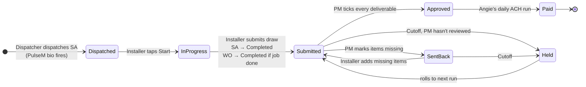

# Vista draw approval flow

Status: **design, not deployed.** Built entirely in Field Service on existing objects and fields.
Nothing here is wired to Salesforce until Matt signs off (see *Build and rollout* at the bottom).

## The flow in one paragraph

Dispatch sends the job. The installer sees a job only after the ServiceAppointment is **Dispatched**, which is also what fires the PulseM bio.
The installer taps Start, does the work, and submits the draw from the phone with photos and the checklist.
Submitting completes the visit and, when the installer says the job is done, closes the WorkOrder.
The PM reviews the draw on the phone as a **deliverables checklist** and either approves it or sends it back with the missed items.
Every morning Angie runs one ACH disbursement from the PM-approved list.
Anything not approved at the cutoff is not paid that day, and the subcontractor gets a text in their language listing exactly what was missed.

## Who does what

| Step | Who | Where | Salesforce effect |
|---|---|---|---|
| 1. Dispatch | Dispatcher | Field Service console / Gantt | `ServiceAppointment.Status = Dispatched`. Existing PulseM automation sends the bio (`PulseM_appt_trigger__c`, `PulseM_Bio_Sent__c`). **Vista shows nothing that is not Dispatched.** |
| 2. Start | Installer | Vista · Job | `ServiceAppointment.Status = In Progress`, `ActualStartTime = now` |
| 3. Submit draw | Installer | Vista · Submit Draw | Creates `SA_Expense__c` (`Type__c = Vista`, `Status__c = Submitted`). Flow A completes the SA and closes the WO. |
| 4. Review | PM | Vista · Approve | Checklist review. Approve → `Status__c = Approved`. Send back → `Status__c = Rejected` + missed items. |
| 5. Disburse | Angie | Salesforce list view *Vista · Ready for ACH* | Links each draw to the payable invoice in her run (`Payable_Invoice_New__c`), which is how Vista shows *Paid*. |
| 6. Chase | Vista API | daily at cutoff | Texts each sub whose draws are not approved, listing what's missing. Nudges PMs with unreviewed draws. |

## PM review: the deliverables checklist

The Approve screen turns the trade's requirements into a list the PM ticks one by one. Approve stays disabled until every required line is ticked.
Unticked lines become the "what was missed" message.

| Line | Source | Required |
|---|---|---|
| One line per required photo kind, e.g. *Before, each elevation — 4 of 4* | `web/content/checklists/<trade>.json → photos[]` vs the photos in the manifest | yes when `min > 0` |
| Installer checklist completed, e.g. *10 of 10 steps* | manifest `checklist.done` | yes |
| Work description matches scope | `Description_of_Work_Performed__c` vs WO `Description` and line items | yes |
| Job complete as claimed | `Did_you_complete_the_job_or_service__c` | yes |
| Amount within contract | `Amount__c` ≤ `Job__c.Sales_Price__c − Total_SA_Expense_Labor__c` | yes |
| Additional work documented, if claimed | `Additional_Work_Performed__c = Yes` ⇒ note + photo | only if claimed |

Each missed line carries a short reason the PM can pick or type ("blurry", "wrong elevation", "missing serial label"). That text is what the sub receives.

**Override.** A PM can still approve in Salesforce without the app. A validation rule requires `Approver__c` to read `Name — reason` when a Vista draw is approved outside the app, so there is always a reason on record.

## Angie's daily run

- **Cutoff: 10:00 AM Eastern, Monday–Friday** (default; Angie to confirm).
- **List view *Vista · Ready for ACH*** on `SA_Expense__c`: `Type__c = Vista`, `Status__c = Approved`, `TEST_SA__c = false`, `Do_Not_Pay__c = false`, `Payable_Invoice_New__c` blank, `LastModifiedDate` before today's cutoff.
- **Report *Vista · Not in today's run*:** `Type__c = Vista`, `Status__c in (Submitted, Rejected)`, grouped by PM. This is who did not get paid and why.
- Angie builds the ACH from the list view. Linking each draw to its payable invoice marks it paid everywhere, including the installer's phone.
- **The existing Jotform batch keeps running unchanged**, but it must skip `Type__c = Vista`, or a Vista draw could be paid twice. See open decision 1.

## Salesforce automation to build

All on existing objects and fields. The only schema-adjacent change is **one new picklist value, `Vista`, on `SA_Expense__c.Type__c`**. That is a value, not a field, and it is what keeps the two pay paths apart.

### Flow A · *Vista – Draw submitted* (record-triggered, after insert, `SA_Expense__c`)

Entry: `Type__c = Vista` and `Status__c = Submitted` and `TEST_SA__c = false`.

1. Update the linked `ServiceAppointment` (`Service_Appointment__c`): `Status = Completed`, `ActualEndTime = now`.
2. If `Did_you_complete_the_job_or_service__c = Yes` **and** the WorkOrder has no other ServiceAppointment still open (`StatusCategory not in (Completed, Canceled)`):
   update the `WorkOrder`: `Status = Completed`, and stamp `Time_Stamp_Installation_Completed__c` and `Time_Stamp_Completed__c` so the milestone reporting that normally keys off *Installation Completed* still has its dates.
3. If the job is not done, or another crew still has an open visit, leave the WO open. The dispatcher schedules the next visit as usual.

### Flow B · *Vista – PM decision* (record-triggered, after update, `SA_Expense__c`)

Entry: `Type__c = Vista` and `Status__c` changed.

- To `Approved`: nothing else. It appears in Angie's list view.
- To `Rejected`: nothing in Salesforce. The API has already written the missed items into the manifest; the installer's phone shows them immediately.
- Back to `Submitted` after a resubmit: nothing. It re-enters the PM queue.

Flow B exists mainly as the hook for future notifications. It can be skipped in v1.

### Validation rule · *Vista_Approval_Needs_Reason*

On `SA_Expense__c`: blocks `Status__c → Approved` on a `Type__c = Vista` record when the change is not made by the Vista integration user and `Approver__c` does not contain " — ".

### List view and report
As described under *Angie's daily run*.

## Messages to subcontractors

Sent by the Vista API's scheduled job at the cutoff, not by Salesforce, so Salesforce makes no outbound calls.
One text per sub per day, in the installer's language, respecting `ServiceAppointment.SMS_Opt_out__c`. Opted-out subs see the same message in the app.

**English**
> Vista: 1 draw was not in today's pay run. Job 00041859 (Hall, 512 Lakeside Dr): missing before photos, 2 of 4 elevations; house wrap photos. Add them in Vista and your PM will re-review for tomorrow's run.

**Español**
> Vista: 1 cobro no entró en el pago de hoy. Trabajo 00041859 (Hall, 512 Lakeside Dr): faltan fotos de antes, 2 de 4 fachadas; fotos de la membrana. Agrégalas en Vista y tu PM lo revisará para el pago de mañana.

**Not reviewed yet** (still `Submitted` at cutoff): the sub gets "still in review, will be in the next run", and the PM gets one reminder listing their unreviewed draws.

## What changes in the Vista app

| Screen | Change |
|---|---|
| Today | Built from the installer's **Dispatched / In Progress** ServiceAppointments only. Scheduled-but-not-dispatched visits are invisible. |
| Job | *Start job* sets the ServiceAppointment to In Progress. There is no *Finish* button: submitting the draw finishes the visit. |
| Submit Draw | Requires the visit to be In Progress. Asks "Is the job complete?" (drives the WO close). Blocks submission until the trade's photo minimums are met. |
| Approve (PM) | The deliverables checklist above. Approve, or Send back with missed items. |
| Ask Vi | Unchanged. |

## Guardrails

- **Double pay.** Only the Vista run pays `Type__c = Vista`. The Jotform batch must exclude it before the first Vista draw exists.
- **Partial jobs.** The WO only closes when the installer says the job is done and no other visit on it is open.
- **Test records.** Heartbeat draws use `Status__c = New` and `TEST_SA__c = true`, so they never reach the PM queue, the list view, or the report.
- **Audit.** Every PM decision is in the manifest (`approval.by`, `at`, `decision`, `missed[]`) and in `Approver__c`. Field history on `Status__c` should be switched on if it isn't already.

## Open decisions

| # | Who | Question | Default |
|---|---|---|---|
| 1 | Angie | Can the existing Jotform batch filter out `Type__c = Vista`? If it keys on something else, what? | Add the filter before the first Vista draw. |
| 2 | Angie | Cutoff time and days for the daily run. | 10:00 AM ET, Mon–Fri. |
| 3 | Angie | Does the ACH mark draws paid by `Payable_Invoice_New__c` (subs, AP) or `Paycheck_Period__c` (employees, Paycom), or both? | Subs via payable invoice. |
| 4 | Mike | WO close on submit sets `Completed` directly (skipping *Installation Completed*) with both timestamps stamped. OK, or should it stop at *Installation Completed* for the office to finish? | `Completed` + timestamps. |
| 5 | Mike | Who gets the "not reviewed" reminder: the job's `Production_Manager__c` only, or also the office administrator? | PM only. |
| 6 | Matt | Add the `Vista` value to `Type__c`. It is the one metadata change the flow needs. | Yes. |

## Build and rollout

1. Build Flow A, the validation rule, the list view and the report in the **DevSandi** sandbox, plus the `Vista` picklist value.
2. Run one Augusta crew end to end in the sandbox with `TEST_SA__c = true` draws.
3. Angie dry-runs the list view for a week against real Jotform draws, to prove the two paths never overlap.
4. Deploy to production. First real Vista draws from the two Augusta crews only.
